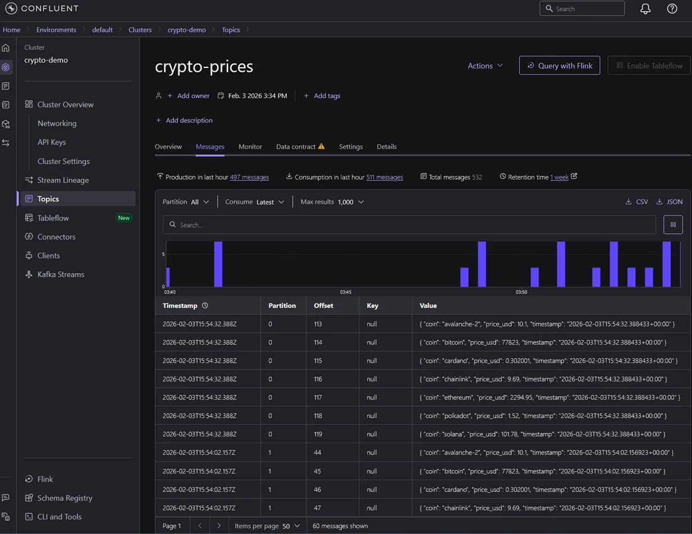
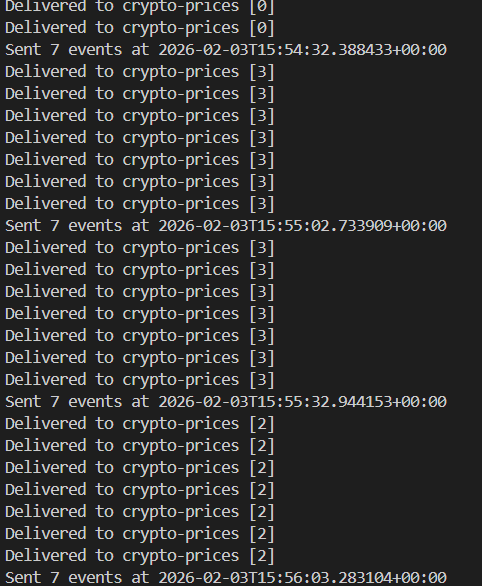
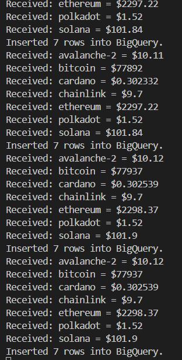
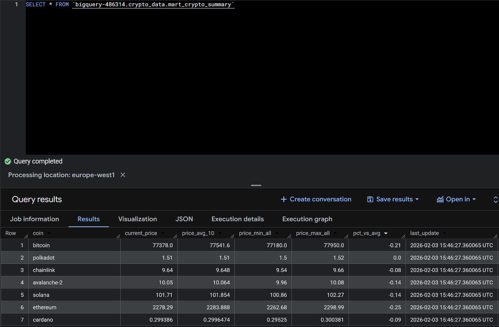

# Real-time Crypto ELT

Real-time ELT pipeline: Kafka → BigQuery → dbt

## Architecture
```
CoinGecko API
     ↓
Producer (fetch prices → send to Kafka)
     ↓
Confluent Cloud (Kafka) — stores events
     ↓
Consumer (read from Kafka → insert into BigQuery)
     ↓
BigQuery (raw_prices table)
     ↓
dbt (orchestrates SQL transformations)
     ↓
BigQuery (executes queries, stores results)
```



## How it works

1. **Producer** fetches crypto prices from CoinGecko API every 30s and sends them to Kafka
2. **Kafka** (Confluent Cloud) stores events in the `crypto-prices` topic — acts as a buffer between producer and consumer
3. **Consumer** reads from Kafka and inserts raw data into BigQuery (`raw_prices` table)
4. **dbt** orchestrates SQL transformations: it generates SQL, manages dependencies, and sends queries to BigQuery
5. **BigQuery** executes the transformations and stores the results (views and tables)

## Why Kafka between API and BigQuery?

Without Kafka, if BigQuery is slow or down, data is lost. Kafka acts as a resilient buffer:
- Producer doesn't wait for BigQuery
- Consumer reads at its own pace
- Messages are retained even if consumer crashes
- Easy to add more consumers (e.g., alerts, other databases)

## Why dbt?

dbt is a SQL orchestrator — it doesn't compute anything itself. It:
- Manages transformation order (DAG via `ref()`)
- Generates and sends SQL to BigQuery
- BigQuery executes the queries and stores results

Think of it like Airflow but specialized for SQL transformations.

## Stack

- **Kafka** (Confluent Cloud): event streaming and buffering
- **BigQuery**: data warehouse (storage + compute)
- **dbt**: SQL orchestration and transformation management
- **Python**: producer & consumer scripts

## Project Structure
```
realtime-crypto-elt/
├── kafka/
│   └── producer.py          # Fetches crypto prices, sends to Kafka
├── ingestion/
│   └── consumer.py          # Reads Kafka, inserts into BigQuery
├── dbt_transform/
│   ├── models/
│   │   ├── staging/         # Raw data cleaning
│   │   ├── intermediate/    # Business logic (moving averages, stats)
│   │   └── marts/           # Final analytics tables
│   └── dbt_project.yml
├── docs/                    # Screenshots
└── README.md
```

## Pipeline Details

### Producer

Fetches prices from CoinGecko API every 30 seconds for: Bitcoin, Ethereum, Solana, Cardano, Polkadot, Avalanche, Chainlink.



### Consumer

Reads messages from Kafka, batches them (10 messages), and inserts into BigQuery `raw_prices` table.



### dbt Models

| Model | Type | Description |
|-------|------|-------------|
| `stg_raw_prices` | view | Clean raw data, rename columns |
| `int_prices_with_stats` | view | Add moving average (10 points), min/max stats |
| `mart_crypto_summary` | table | Latest price per coin with analytics |

**Final output:**



## Setup

### Prerequisites

- Python 3.12+
- uv (package manager)
- Confluent Cloud account (free tier)
- GCP account with BigQuery enabled

### Installation
```bash
git clone https://github.com/cloudspawn/realtime-crypto-elt.git
cd realtime-crypto-elt
uv sync
```

### Configuration

Create `.env` at root:
```
KAFKA_BOOTSTRAP_SERVERS=your-confluent-server:9092
KAFKA_API_KEY=your-key
KAFKA_API_SECRET=your-secret
GCP_PROJECT_ID=your-project-id
GCP_CREDENTIALS_PATH=secrets/gcp-key.json
BQ_DATASET=crypto_data
BQ_TABLE=raw_prices
```

### Run

Terminal 1 - Producer:
```bash
uv run python kafka/producer.py
```

Terminal 2 - Consumer:
```bash
uv run python ingestion/consumer.py
```

Terminal 3 - dbt:
```bash
cd dbt_transform
dbt run
```

## License

MIT